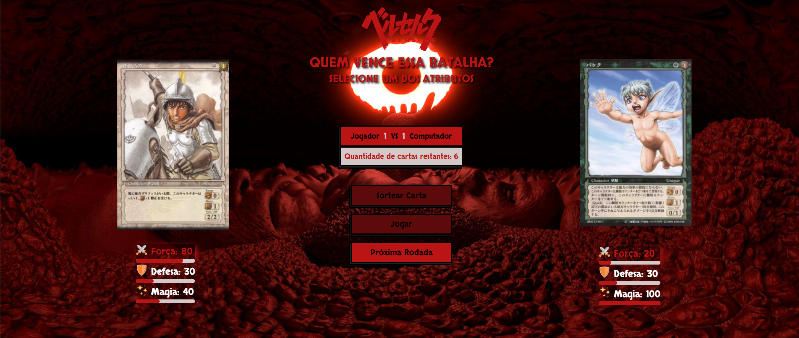

#  Desafio Cartas Super Trunfo (Berserk Edition)

Este é um **jogo de cartas online** inspirado no universo do mangá *Berserk*. Baseado na mecânica de "Super Trunfo", o jogador e o computador se enfrentam rodada a rodada, escolhendo atributos de personagens icônicos para disputar pontos.

O jogo foi desenvolvido utilizando **HTML5**, **CSS3** e **JavaScript**, com uma interface envolvente, efeitos sonoros e alertas interativos via **SweetAlert2**.

---

## Objetivo do Jogo
Cada personagem possui três atributos:
- **Força**
- **Defesa**
- **Magia**

Durante cada rodada:
1. O jogador sorteia uma carta e escolhe um dos atributos.
2. O computador também recebe uma carta aleatória.
3. Os valores do atributo escolhido são comparados.
4. Quem tiver o maior valor vence a rodada.

Ao final das cartas, quem tiver mais vitórias é declarado o vencedor.

---

## Estrutura dos Arquivos

### `index.html`
Contém a estrutura principal da interface:
- Cabeçalho com título e logo;
- Cartas do jogador e do computador;
- Placar e contagem de cartas restantes;
- Botões de interação;
- Inclusão de scripts e arquivos de estilo;
- Áudios incorporados.

### `styles.css`
Responsável pela aparência visual do jogo:
- Cores, fontes e plano de fundo;
- Layout das cartas e dos botões;
- Animações e responsividade.

### `main.js`
Lógica principal do jogo:
- Sorteio de cartas;
- Comparação de atributos;
- Atualização da interface e placar;
- Controle das rodadas e fim de jogo;
- Integração com alertas e efeitos sonoros.

### `deck.js`
Baralho contendo os personagens, com:
- Nome
- URL da imagem
- Valores de atributos: `strength`, `defense`, `magic`

### `favicon.ico`
Ícone do site exibido na aba do navegador.

---

## Tecnologias Utilizadas
- **HTML5**: Estrutura do jogo.
- **CSS3**: Design visual e animações.
- **JavaScript Vanilla**: Lógica interativa.
- **SweetAlert2**: Alertas personalizados.
- **Google Fonts**: Fontes estilizadas.
- **Freesound**: Efeitos sonoros.

---

##  Como Jogar

1. Clique em **"Sortear Carta"**.
2. Escolha um atributo (Força, Defesa ou Magia).
3. Clique em **"Jogar"** para ver o resultado da rodada.
4. Continue jogando até que todas as cartas acabem.
5. Veja quem ganhou e clique em **"Jogar Novamente"** se quiser reiniciar.

---

## Funcionalidades

- Cartas com imagens e atributos dinâmicos.
- Placar de jogador vs computador.
- Contador de cartas restantes.
- Áudios de efeito para ações.
- Feedback visual com animações e alertas.

---

## 📷 Prévia Visual

 <!-- Adicione uma imagem real do jogo aqui, se desejar -->

---

## Desenvolvido para fins educacionais
Este projeto foi desenvolvido como parte de uma atividade acadêmica para a disciplina de Desenvolvimento Web, com o objetivo de aplicar conhecimentos de HTML, CSS e JavaScript em um projeto interativo.

---
